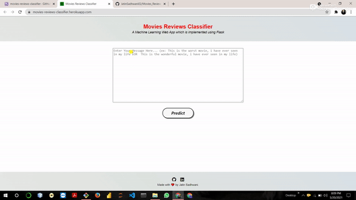

# Movies_Review_Classification_NLP

<h3>Dataset Link : https://www.kaggle.com/lakshmi25npathi/imdb-dataset-of-50k-movie-reviews</h3>
 

<h3> Deployment Link : https://movies-reviews-classifier.herokuapp.com/ </h3>
 

I implemented a Natural Language Processing based project. The project is Movies Reviews Sentiment Analysis who classify that the given review about the movie is a positive review or a negative review. So i train my model on the movies reviews dataset and use that model for implement end to end application. End-to-end means i deployed this model using the Python Framework flask on the localhost. And also deploy on the heroku. So i use a naive-bayes algorithm to train my model, this is probability based algorithm.

 
<h1> Working of Movies Reviews Classifier</h1>
 

 
<h1> Thank You !!!!!!!!!!!</h1>
